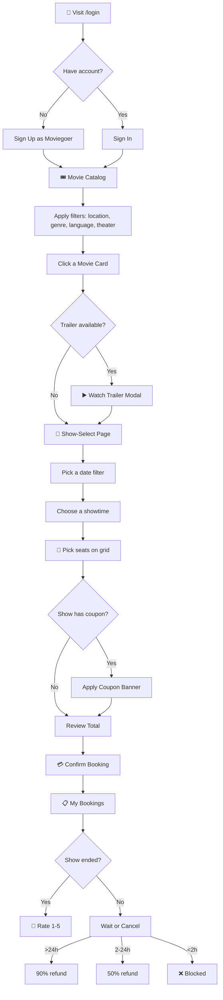
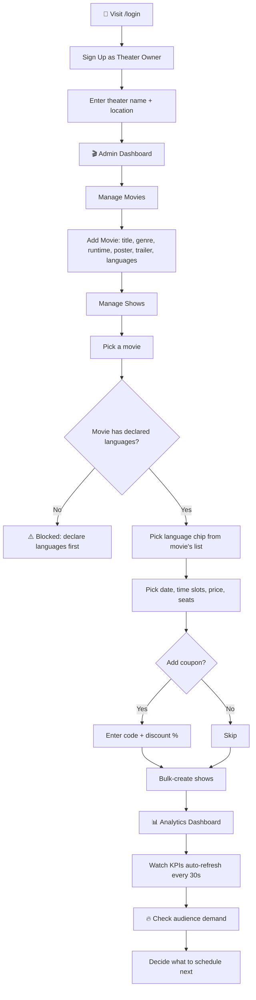

<div align="center">

# 🎬 CineBook

### Production-grade multi-tenant movie ticket booking platform


**Moviegoers book seats in seconds. Theater owners run their own admin console with live analytics, coupons, audience demand signals, and per-show language enforcement.**

</div>

---

## 📑 Table of Contents

- [Features](#-features)
- [User Roles & Privileges](#-user-roles--privileges)
- [Tech Stack](#-tech-stack)
- [Application Flow](#-application-flow)
- [API Reference](#-api-reference)
- [What Makes CineBook Different](#-what-makes-cinebook-different)
- [Getting Started — Fork & Run](#-getting-started--fork--run)
- [Future Enhancements](#-future-enhancements)
- [Project Structure](#-project-structure)

---

## ✨ Features

### 🎟️ For Moviegoers
| Feature | Description |
|---|---|
| 🎥 **Movie Catalog** | Browse now-showing titles with posters, genre, runtime, ratings, languages and trailers |
| 🔎 **Smart Filters** | Filter by genre, theater, location, language, and free-text search — all combinable |
| 🏛️ **Browse by Theater** | Dedicated page listing every theater with its currently-scheduled lineup |
| 📍 **Navbar Location Picker** | Choose your city once — theaters/movies/shows filter automatically across the app |
| 📅 **Date Filter on Showtimes** | Narrow shows to a specific day instead of scrolling through all upcoming slots |
| 🎬 **YouTube Trailers** | Watch trailers in a card-level modal and as an embedded preview on the show-select page |
| 💺 **Interactive Seat Picker** | 10-column grid with screen orientation, color-coded availability, live booked-seat updates |
| 🎫 **Per-Show Coupons** | Coupon code + discount % attached by admins; one-click "Apply" at checkout |
| 💰 **Transparent Pricing** | Subtotal → discount → 4% GST → total, all itemized before you confirm |
| 🍅 **Tomato Ratings** | Star-equivalent ratings shown on every movie card with review count |
| ⭐ **Post-Show Reviews** | Rate a movie 1–5 🍅 only after the show has actually finished; one review per booking |
| ⏰ **30-Minute Reminders** | Sticky banner on every user page when a booking is starting soon |
| 🎁 **Offers Page** | Browse every active coupon across all theaters, grouped by movie |
| ❤️ **Show Interest** | When a movie has no shows, register interest — admins see the demand on their dashboard |
| 💸 **Smart Cancellation** | Automatic refund tiers — 90% if >24h before, 50% if 2–24h, blocked under 2h |
| 🌐 **Per-Show Language** | Each show advertises its specific language; booking is blocked if it doesn't match the movie's declared languages |

### 🏢 For Theater Owners (Admins)
| Feature | Description |
|---|---|
| 🎬 **Movie Catalog Management** | Add/edit/delete movies, attach posters, trailers, default prices, and language chips |
| 🗣️ **Language Chip Selector** | Toggle Telugu / Hindi / English / Tamil / Kannada / Malayalam or type custom — stored as CSV |
| 📅 **Bulk Show Scheduling** | Pick a date and stack multiple time-slots into a single batch create |
| 🎫 **Per-Show Coupons** | Attach `WEEKEND20` style codes with 1-100% discount, visible to all users in Offers |
| 🌐 **Validated Show Languages** | Language must be one of the movie's declared options — no typos, no mismatches |
| 📊 **Live Analytics Dashboard** | KPIs, bookings-over-time line chart, revenue-by-movie bar chart, status doughnut, fill-rate table |
| 🔥 **Audience Interest Board** | See exactly which movies users are waiting for — poster + count, ranked by demand |
| 🔄 **Auto-refresh** | Analytics polls every 30s with a "last updated" indicator and manual refresh |
| 🛡️ **Theater Isolation** | An admin only ever sees their own shows, bookings, and analytics — multi-tenant by design |
| 🗑️ **Safe Deletion** | Movies/shows with active bookings can't be deleted — impact preview shown in confirm modal |

---

## 👥 User Roles & Privileges

<table>
<tr>
<th width="50%">🎬 USER (Moviegoer)</th>
<th width="50%">🛡️ ADMIN (Theater Owner)</th>
</tr>
<tr>
<td valign="top">

**Can do:**
- ✅ Browse movies, theaters, shows, offers
- ✅ Filter by location/genre/language/theater
- ✅ Watch trailers
- ✅ Book seats with optional coupon
- ✅ View their own booking history
- ✅ Cancel their own bookings (subject to refund tiers)
- ✅ Submit a 🍅 rating after a show ends
- ✅ Register interest in a movie
- ✅ Change location, search, filter freely

**Cannot do:**
- ❌ View other users' bookings
- ❌ Create / edit / delete movies or shows
- ❌ Access analytics or admin dashboards
- ❌ Manage theaters or coupons

</td>
<td valign="top">

**Can do everything a USER can, plus:**
- ✅ Set up / own exactly one theater
- ✅ Add / edit / delete movies (with active-booking guard)
- ✅ Schedule shows (single or bulk) with coupons + language
- ✅ Delete their own theater's shows
- ✅ View every booking placed against their theater
- ✅ Cancel any booking in their theater
- ✅ Open the analytics dashboard with charts + KPIs
- ✅ See audience-interest demand signals

**Scoped:**
- 🔒 Only sees their own theater's data
- 🔒 Cannot manage another admin's catalog
- 🔒 Cannot escalate users to admin

</td>
</tr>
</table>

---

## 🛠️ Tech Stack

### Backend
| Layer | Technology | Why |
|---|---|---|
| 🟢 Runtime | **Java 21** + **Spring Boot 3.3** | Modern LTS, fast startup, virtual-threads ready |
| 🔐 Security | **Spring Security 6** + **JWT (jjwt 0.12.6)** + **BCrypt** | Stateless auth, 24h tokens, legacy-password auto-migration |
| 💾 Persistence | **Spring Data JPA** + **Hibernate** | `ddl-auto=update` for fast dev iteration |
| 🗄️ Database | **MySQL 8** | Production-grade RDBMS |
| 🏗️ Build | **Maven** | Standard Java tooling |

### Frontend
| Layer | Technology | Why |
|---|---|---|
| 🅰️ Framework | **Angular 17** (standalone components) | New control flow `@if` / `@for`, signals, OnPush by default |
| ⚡ Reactivity | **Signals** + **computed()** + **effect()** | Fine-grained reactivity, no NgRx overhead |
| 🎨 Styling | **Tailwind CSS 3** | Utility-first, design-system consistency |
| 📊 Charts | **Chart.js 4** + **ng2-charts 5** | Line / bar / doughnut + responsive |
| 🎨 Icons | **Custom Lucide-style IconComponent** (~70 SVG icons) | Zero external icon-lib dependency, hover transitions built-in |
| 🌐 HTTP | **HttpClient** + **HttpInterceptorFn** | JWT injection + 401 auto-logout |

### Tooling
- 🧪 Type-checked with `ng build` (strict mode)
- 🎯 Spring Boot DevTools for hot reload
- 🔧 npm 10+ / Maven 3.9+

---

## 🌊 Application Flow

### 🎬 Moviegoer Flow



### 🛡️ Theater Owner Flow



---

## 📡 API Reference

> **Base URL:** `http://localhost:8181/api`
> **Auth:** Bearer JWT in `Authorization` header — except `/api/auth/login`, `/api/auth/register`, `/api/auth/register-admin`.
> **JWT lifetime:** 24 hours. On 401 the frontend auto-logs-out and redirects to `/login`.

### 🔓 Public — Authentication

| Method | Endpoint | Body | Returns | Description |
|---|---|---|---|---|
| 🟢 `POST` | `/api/auth/register` | `{username, password}` | `{token, id, username, role}` | Register a new moviegoer |
| 🟢 `POST` | `/api/auth/register-admin` | `{username, password, theaterName, theaterLocation}` | `{token, id, username, role}` | Register a theater owner; auto-creates their theater |
| 🟢 `POST` | `/api/auth/login` | `{username, password}` | `{token, id, username, role}` | Sign in. **Auto-migrates** plaintext-era passwords to BCrypt on first successful login |
| 🛡️ `POST` | `/api/auth/setup-theater` | `{name, location}` | `{token, id, username, role}` | Legacy admins without a theater can create one |

---

### 🎬 USER endpoints (any authenticated user)

#### 🎞️ Movies
| Method | Endpoint | Query Params | Description |
|---|---|---|---|
| `GET` | `/api/movies` | `theaterId?`, `location?`, `language?` | List movies, optionally filtered. Each row includes `averageRating`, `reviewCount`, `languages`, `trailerUrl` |

#### 🎭 Shows
| Method | Endpoint | Query Params | Description |
|---|---|---|---|
| `GET` | `/api/shows` | `movieId?`, `theaterId?`, `location?`, `date?` (YYYY-MM-DD) | Filter shows; at least one filter required |
| `GET` | `/api/shows/offers` | — | All upcoming shows that currently have a coupon attached |
| `GET` | `/api/shows/{showId}/booked-seats` | — | List of seat IDs already booked for this show |

#### 🏛️ Theaters
| Method | Endpoint | Query Params | Description |
|---|---|---|---|
| `GET` | `/api/theaters` | `location?` | All theaters, optionally filtered by city/area |
| `GET` | `/api/theaters/locations` | — | Distinct location strings — feeds the navbar location picker |

#### 🎫 Bookings
| Method | Endpoint | Body | Description |
|---|---|---|---|
| `POST` | `/api/bookings` | `{showId, seats[], couponCode?}` | Create a booking. `userId` is **always** taken from JWT — client-supplied id is ignored |
| `GET` | `/api/bookings/user/{userId}` | — | A user's bookings (users can only see their own; admins can see any) |
| `POST` | `/api/bookings/{id}/cancel` | — | Cancel with the refund-tier policy |

#### ⭐ Reviews
| Method | Endpoint | Body | Description |
|---|---|---|---|
| `POST` | `/api/reviews` | `{bookingId, rating}` | Submit a 1–5 rating. Booking must be the user's, CONFIRMED, and the show must have ended |
| `GET` | `/api/reviews/can-review/{bookingId}` | — | `{canReview: bool, existingRating: int?}` — drives UI gating |
| `GET` | `/api/reviews/movie/{movieId}` | — | All reviews for a movie |

#### ❤️ Audience Interest
| Method | Endpoint | Description |
|---|---|---|
| `POST` | `/api/interests/{movieId}` | "I'm interested" — idempotent; returns `{interested, count}` |
| `GET` | `/api/interests/movie/{movieId}` | Status for the current user + total count |

---

### 🛡️ ADMIN endpoints (require `ROLE_ADMIN`)

#### 🎬 Movies
| Method | Endpoint | Body | Description |
|---|---|---|---|
| `POST` | `/api/movies` | `{title, genre, durationMins, posterUrl, price, trailerUrl, languages}` | Create a new movie |
| `PUT` | `/api/movies/{id}` | Partial Movie | Update fields — only non-null ones overwrite |
| `DELETE` | `/api/movies/{id}` | — | Delete with active-booking safety check |

#### 🎭 Shows
| Method | Endpoint | Body | Description |
|---|---|---|---|
| `POST` | `/api/shows` | `{movieId, showTime, ticketPrice, totalSeats, couponCode?, discountPercent?, language}` | Create one show. **Language must be one of the movie's declared languages** |
| `POST` | `/api/shows/bulk` | `{movieId, showTimes[], ticketPrice, totalSeats, couponCode?, discountPercent?, language}` | Batch-create on a single date |
| `GET` | `/api/shows/all` | — | All shows for the admin's theater |
| `DELETE` | `/api/shows/{id}` | — | Only if it's in the admin's theater and has no active bookings |

#### 🎫 Bookings
| Method | Endpoint | Description |
|---|---|---|
| `GET` | `/api/bookings` | All bookings for the admin's theater |

#### 📊 Analytics (all scoped to the admin's theater)
| Method | Endpoint | Query | Description |
|---|---|---|---|
| `GET` | `/api/analytics/overview` | — | Total revenue, total/confirmed/cancelled bookings, total seats sold |
| `GET` | `/api/analytics/bookings-over-time` | `days=30` | Daily bookings + revenue timeseries |
| `GET` | `/api/analytics/revenue-by-movie` | — | Revenue grouped by movie |
| `GET` | `/api/analytics/show-fillrate` | — | Per-show fill-rate percentage |

#### 🔥 Audience Demand
| Method | Endpoint | Description |
|---|---|---|
| `GET` | `/api/interests/dashboard` | All movies ranked by interest count — `[{movieId, title, posterUrl, count}]` |

---

## 🌟 What Makes CineBook Different

### 🛡️ Multi-Tenant Theater Isolation
Every admin owns exactly **one** theater (linked via `users.theater_id`). Every list-by-theater query is automatically scoped through `requireAdminTheater(adminUserId)` — meaning admin A literally **cannot see** admin B's shows, bookings, or analytics. No accidental data leaks.

### 🌐 Defence-in-Depth Language Validation
Shows must be in a language the movie actually supports.
- ✅ **Admin form** — chip selector built from the movie's declared languages; no free-text fallback.
- ✅ **Show creation** — `ShowService.resolveShowLanguage()` blocks mismatched server-side requests.
- ✅ **Booking time** — `BookingService` re-validates the show's stored language against the movie's CSV, blocking legacy rows that pre-date the validation rule.

### 🔐 Production-Grade Auth with Zero-Disruption Migration
Started with demo header-based auth; upgraded to **JWT + BCrypt** without breaking existing users. `AuthService.verifyAndMigratePassword()` detects BCrypt-hash prefixes (`$2a$`/`$2b$`/`$2y$`) and falls back to plaintext compare — automatically **re-hashing** on successful login. Existing users never need to reset their password.

### 💸 Transparent, Itemized Pricing
Every booking shows:
```
Subtotal     (seats × price)
− Discount   (only when coupon applied)
+ Tax 4%     (on subtotal − discount)
= Total
```
No surprise charges. Tax rate centralized as `BookingService.TAX_RATE`.

### 🍅 Real Tomato Ratings
Replaced the typical 5-star UI with 🍅 tomato icons — distinctive, on-brand, and immediately recognizable as "Rotten-Tomatoes-style."

### 🔥 Audience Demand Signals
When a movie has zero shows, users click **"I'm interested"** — admins see a live demand ranking on their dashboard. Bridges the gap between user wishlists and admin scheduling decisions.

### 📊 Production-Quality Analytics
Not a screenshot from a tutorial — 4 chart types (line, bar, doughnut, fill-rate progress table) with:
- 30-second auto-refresh + manual refresh button
- "Last updated" indicator
- Independent subscriptions so one failure doesn't blank the whole dashboard
- Per-endpoint error banner with HTTP status for debugging

### 📍 Persistent Location Filter
The navbar location picker uses `LocationService` backed by `localStorage`. Pick "Hyderabad" once and theaters/movies/shows filter across the entire app — reload-resilient, no flicker.

### ⏰ Sticky 30-Minute Reminders
A booking starting within 30 minutes shows a top banner on every user page with a one-tap dismiss. Driven by reactive signals — no polling spam.

### 🎨 Custom Icon System
Built our own `IconComponent` with ~70 Lucide-style inline SVGs (`film`, `armchair`, `ticket-percent`, `flame`, `chevron-down`, etc.) — zero external icon-lib dependency, built-in hover transitions, fully tree-shakable.

### 🛡️ Safe Deletion with Impact Preview
Deleting a movie or show shows you exactly what's at stake — total shows, upcoming shows, active bookings, cancelled history — and **blocks** the action if any active bookings exist. No silent data loss.

---

## 🚀 Getting Started — Fork & Run

### 📋 Prerequisites
| Tool | Version | Check |
|---|---|---|
| ☕ JDK | 21+ | `java -version` |
| 📦 Maven | 3.9+ | `mvn -version` |
| 🟢 Node.js | 18+ | `node -v` |
| 📦 npm | 10+ | `npm -v` |
| 🗄️ MySQL | 8+ (running) | `mysql --version` |

### 1️⃣ Fork & Clone
```bash
# Fork on GitHub, then clone your fork:
git clone https://github.com/<your-username>/movie-ticket-booking.git
cd movie-ticket-booking
```

### 2️⃣ Create the Database
```sql
CREATE DATABASE movieapp;
CREATE USER 'movieapp'@'localhost' IDENTIFIED BY 'movieapp';
GRANT ALL PRIVILEGES ON movieapp.* TO 'movieapp'@'localhost';
FLUSH PRIVILEGES;
```
Hibernate's `ddl-auto=update` will create every table on first boot.

### 3️⃣ Configure the Backend
Edit `backend/src/main/resources/application.properties` (or set env vars):
```properties
spring.datasource.url=jdbc:mysql://localhost:3306/movieapp
spring.datasource.username=movieapp
spring.datasource.password=movieapp

# In production set these via env, not in the file:
app.jwt.secret=${APP_JWT_SECRET:base64-encoded-secret-here}
app.jwt.expiration-ms=86400000
```

> ⚠️ **Security note:** Change `app.jwt.secret` before any non-dev deployment. The default value in the repo is for local development only.

### 4️⃣ Run the Backend
```bash
cd backend
mvn spring-boot:run
```
Backend boots on **http://localhost:8181**. Watch the logs for `Started CineBookApplication in X seconds`.

### 5️⃣ Run the Frontend
```bash
cd frontend
npm install --legacy-peer-deps
npm start
```
Frontend boots on **http://localhost:4200** and proxies API calls to `:8181`.

> ℹ️ The `--legacy-peer-deps` flag is needed because `ng2-charts` 5.x declares a peer-dep on a newer `@angular/cdk` than Angular 17 ships with — this is the documented workaround.

### 6️⃣ Try It Out
1. 👤 Open **http://localhost:4200**
2. 🛡️ Click **Create Account → Theater Owner**, fill in theater name + location
3. 🎬 You're dropped into **/admin** — add a movie with at least one language, then schedule shows
4. 🚪 Log out, register a new **Moviegoer** account
5. 🎟️ Book seats → cancel → review after the show ends → 🎉

---

## 🔮 Future Enhancements

### 🎯 High-Impact
- 💳 **Real Payment Gateway** — Stripe / Razorpay integration instead of the current "instant-confirm" mock
- 📧 **Email Notifications** — booking confirmations, cancellation receipts, show reminders
- 📱 **Mobile App** — React Native or Flutter using the existing REST API
- 🎟️ **QR-Code E-Tickets** — generate scannable codes embedded in My Bookings
- 🔄 **Refresh Tokens** — currently the 24h JWT is the only token; refresh tokens would extend sessions safely

### 🛠️ Platform Improvements
- 🌍 **i18n** — multi-language UI (currently English-only for the chrome, even though shows themselves support multi-language)
- 🌓 **Dark Mode** — Tailwind already wired for it, just needs the toggle
- 🔍 **Server-Side Pagination** — currently lists are unbounded; fine for demo but won't scale past ~1000 movies
- 📦 **Redis Caching** — heavy reads like `/api/movies` + analytics aggregates can be cached for 30–60s
- 🐳 **Docker Compose** — one-command spin-up of mysql + backend + frontend
- 🧪 **Test Suites** — unit tests for services, integration tests for controllers, Playwright for end-to-end

### 🎬 Product Features
- 🪑 **Seat Categories** — VIP / Recliner / Standard with tiered pricing
- 🍿 **Food & Beverage Add-ons** — combo deals at checkout
- 👥 **Group Bookings** — book + split-pay across friends
- 📅 **Recurring Show Templates** — "every Friday 9 PM for 4 weeks" instead of manual bulk-create
- 🎁 **Loyalty Program** — points per booking, redeemable for discounts
- 📊 **Advanced Analytics** — cohort retention, peak-hour heatmaps, predictive demand

### 🛡️ Security & Compliance
- 🔐 **2FA** — TOTP for admin accounts
- 🛡️ **Rate Limiting** — per-IP + per-user buckets on auth endpoints
- 🔍 **Audit Log** — track who deleted what and when
- 🔒 **Row-Level Security** — defense-in-depth even if the service-layer scoping is bypassed

---

## 📁 Project Structure

```
movie-ticket-booking/
├── 📂 backend/                          # Spring Boot 3.3 + Java 21
│   ├── pom.xml
│   └── src/main/java/com/movieapp/
│       ├── 🎮 controller/                # REST endpoints
│       ├── 🧠 service/                   # Business logic
│       ├── 💾 repository/                # Spring Data JPA repositories
│       ├── 🏛️ entity/                    # JPA entities
│       ├── 📦 dto/                       # Request/response DTOs
│       ├── 🔐 security/                  # JWT filter, principal, security config
│       ├── 🛠️ util/                      # LanguageMatcher and friends
│       └── ⚠️ exception/                 # Custom exceptions + global handler
│
├── 📂 frontend/                         # Angular 17 + Tailwind
│   ├── package.json
│   └── src/app/
│       ├── 🏠 app.routes.ts              # Top-level routing + role guards
│       ├── ⚙️ app.config.ts              # Providers, interceptors, Chart.js registration
│       ├── 📂 core/
│       │   ├── 🌐 services/              # auth, movie, show, booking, review, theater, interest, location, analytics
│       │   ├── 📋 models/                # TypeScript interfaces
│       │   └── 🛡️ interceptors/          # JWT auth interceptor
│       ├── 📂 features/
│       │   ├── 🔑 auth/                  # Login + Register page
│       │   ├── 👤 user/                  # Movie grid, show-select, my-bookings, theaters, offers
│       │   └── 🛡️ admin/                 # Manage movies, manage shows, all bookings, analytics
│       └── 📂 shared/                    # IconComponent, PosterCarouselComponent, utils
│
└── 📄 README.md                         # You are here
```

---

<div align="center">

### 🎬 Built with ❤️ for moviegoers and theater owners

**Star ⭐ this repo if you find it useful!**

</div>
