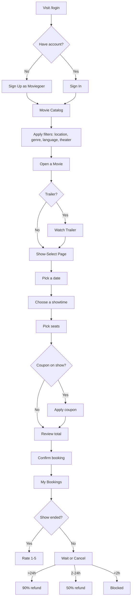
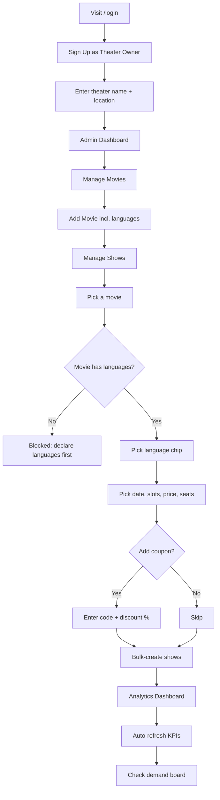

# Software Requirements Specification (SRS)

## CineBook — Multi-Tenant Movie Ticket Booking Platform

| | |
|---|---|
| **Document version** | 1.0 |
| **Date** | 2026-06-05 |
| **Status** | Baseline |
| **Standard** | Adapted from IEEE Std 830-1998 |
| **System** | CineBook |

---

## Table of Contents

1. [Introduction](#1-introduction)
   - 1.1 [Purpose](#11-purpose)
   - 1.2 [Scope](#12-scope)
   - 1.3 [Definitions, Acronyms, and Abbreviations](#13-definitions-acronyms-and-abbreviations)
   - 1.4 [References](#14-references)
   - 1.5 [Overview](#15-overview)
2. [Overall Description](#2-overall-description)
   - 2.1 [Product Perspective](#21-product-perspective)
   - 2.2 [Product Functions](#22-product-functions)
   - 2.3 [User Classes and Characteristics](#23-user-classes-and-characteristics)
   - 2.4 [Operating Environment](#24-operating-environment)
   - 2.5 [Design and Implementation Constraints](#25-design-and-implementation-constraints)
   - 2.6 [Assumptions and Dependencies](#26-assumptions-and-dependencies)
3. [Specific Requirements](#3-specific-requirements)
   - 3.1 [External Interface Requirements](#31-external-interface-requirements)
   - 3.2 [Functional Requirements](#32-functional-requirements)
   - 3.3 [Data Requirements](#33-data-requirements)
4. [Non-Functional Requirements](#4-non-functional-requirements)
5. [System Models](#5-system-models)
6. [Other Requirements](#6-other-requirements)
7. [Appendices](#7-appendices)

---

## 1. Introduction

### 1.1 Purpose

This Software Requirements Specification (SRS) defines the functional and
non-functional requirements for **CineBook**, a production-grade, multi-tenant
movie ticket booking platform. The document is intended for developers, testers,
project reviewers, and other stakeholders who need a precise statement of what
the system must do and the constraints under which it operates. It serves as the
authoritative baseline against which the implementation and its acceptance tests
are validated.

### 1.2 Scope

CineBook is a web application that allows **moviegoers** to discover movies,
browse showtimes across theaters, pick seats on an interactive grid, apply
coupons, and book tickets with transparent itemized pricing. It allows
**theater owners (admins)** to run a self-service console for their own theater:
managing a movie catalog, scheduling shows in bulk, attaching per-show coupons,
enforcing per-show language rules, viewing live analytics, and reading audience
demand signals.

**In scope:**

- User registration/authentication for two roles (USER, ADMIN) with JWT.
- Movie catalog browsing, filtering, and trailer viewing.
- Show scheduling and discovery with date/location/language filters.
- Interactive seat selection and booking with coupon and tax computation.
- Booking cancellation with tiered refund policy.
- Post-show rating/review and audience interest registration.
- Per-theater admin analytics dashboards and demand boards.
- Multi-tenant theater isolation and soft-delete of movies/shows.

**Out of scope (current release):**

- Real payment gateway integration (bookings are instant-confirm mocks).
- Email/SMS notifications and QR e-tickets.
- Server-side pagination, caching, and i18n of the UI chrome.
- Native mobile applications.

### 1.3 Definitions, Acronyms, and Abbreviations

| Term | Definition |
|---|---|
| **Moviegoer / USER** | An end customer who browses and books tickets. |
| **Theater Owner / ADMIN** | A user who owns exactly one theater and manages its catalog, shows, and analytics. |
| **Show** | A scheduled screening of a movie at a specific time, price, seat count, and language. |
| **Coupon** | A code + discount percentage (1–100%) attached to a show by an admin. |
| **Soft delete** | Marking a movie/show as `deleted=true` so it is hidden from listings while its history is preserved. |
| **Multi-tenant isolation** | Architectural guarantee that an admin only ever sees their own theater's data. |
| **GST** | Goods and Services Tax; applied at a flat 4% on the discounted subtotal. |
| **JWT** | JSON Web Token — stateless bearer auth token. |
| **BCrypt** | Adaptive password-hashing function used to store credentials. |
| **KPI** | Key Performance Indicator shown on the analytics dashboard. |
| **SPA** | Single Page Application (Angular frontend). |
| **DTO** | Data Transfer Object. |
| **Tomato rating** | A 1–5 rating, branded with tomato icons (Rotten-Tomatoes style). |

### 1.4 References

- IEEE Std 830-1998 — Recommended Practice for Software Requirements Specifications.
- Project `README.md` — feature overview, API reference, and tech stack.
- Project `USAGE.md` — operational usage notes.
- Spring Boot 3.3, Angular 17, MySQL 8 official documentation.

### 1.5 Overview

Section 2 gives an overall description of the product, its users, and its
constraints. Section 3 enumerates the detailed functional requirements,
external interfaces, and data requirements. Section 4 lists the non-functional
requirements. Section 5 contains system models (use cases, data model, flows).
Sections 6–7 cover other requirements and appendices.

---

## 2. Overall Description

### 2.1 Product Perspective

CineBook is a self-contained, client–server web system composed of three tiers:

1. **Presentation tier** — an Angular 17 single-page application using
   standalone components, signals, and Tailwind CSS.
2. **Application tier** — a Spring Boot 3.3 / Java 21 REST API secured by
   Spring Security 6 with stateless JWT authentication.
3. **Data tier** — a MySQL 8 relational database accessed via Spring Data JPA /
   Hibernate (`ddl-auto=update`).

The frontend communicates with the backend exclusively over HTTP/JSON at the
base URL `http://localhost:8181/api`. The system is **multi-tenant**: each admin
owns exactly one theater, and all theater-scoped queries are isolated per admin.

```
+-------------------+        HTTP/JSON (JWT)        +----------------------+        JDBC        +-----------+
|  Angular 17 SPA   |  <------------------------>   |  Spring Boot 3.3 API  |  <------------->  |  MySQL 8  |
|  (browser :4200)  |                               |   (server :8181)      |                   |           |
+-------------------+                               +----------------------+                    +-----------+
```

### 2.2 Product Functions

At a high level, CineBook provides:

- **Authentication & accounts** — register as moviegoer or theater owner, login,
  JWT issuance, legacy password auto-migration to BCrypt, theater setup.
- **Catalog & discovery** — browse/filter movies and theaters, watch trailers,
  view offers, see ratings.
- **Showtimes** — discover shows filtered by movie/theater/location/date.
- **Booking** — interactive seat selection, coupon application, itemized
  pricing (subtotal − discount + 4% GST), instant confirmation.
- **Post-booking** — view booking history, cancel with tiered refunds, rate
  after a show ends, register interest in movies without shows.
- **Admin management** — manage movies (CRUD with safety guard), schedule shows
  (single/bulk) with coupons and validated languages, view all theater bookings,
  cancel bookings.
- **Admin insights** — live analytics (KPIs, charts, fill-rate) auto-refreshed,
  and an audience-demand board ranking movies by interest count.

### 2.3 User Classes and Characteristics

| User class | Description | Technical skill | Privileges |
|---|---|---|---|
| **Moviegoer (USER)** | End customer booking tickets for personal use. | Low — general web user. | Browse, filter, book, cancel own bookings, rate, register interest. |
| **Theater Owner (ADMIN)** | Operates one theater. | Moderate — comfortable with admin consoles. | All USER abilities **plus** catalog/show/coupon management, theater-scoped bookings & analytics. |
| **Unauthenticated visitor** | Has not logged in. | Low. | Access only login/register screens and public auth endpoints. |
| **System administrator (operator)** | Deploys and maintains the stack. | High — DevOps/DBA. | Configures DB, JWT secret, runs services. |

### 2.4 Operating Environment

| Component | Requirement |
|---|---|
| **Backend runtime** | Java 21+ (LTS), Spring Boot 3.3. |
| **Build** | Maven 3.9+. |
| **Database** | MySQL 8+. |
| **Frontend runtime** | Node.js 18+, npm 10+; Angular 17. |
| **Client** | Modern evergreen browser (Chrome, Edge, Firefox, Safari) with JavaScript enabled. |
| **Network** | Backend on port 8181, frontend dev server on 4200. |

### 2.5 Design and Implementation Constraints

- **DC-1**: Authentication MUST be stateless and based on JWT (24-hour lifetime);
  no server-side session state is kept.
- **DC-2**: Passwords MUST be stored using BCrypt; legacy plaintext passwords
  MUST be transparently migrated to BCrypt on the next successful login.
- **DC-3**: Each ADMIN MUST be linked to exactly one theater
  (`users.theater_id`); all theater-scoped reads MUST be filtered through that
  link.
- **DC-4**: A show's language MUST be one of the parent movie's declared
  languages; this rule is enforced at the admin form, show creation, and booking
  time (defense in depth).
- **DC-5**: Movies and shows MUST be **soft-deleted** (flagged, not physically
  removed) to preserve booking history and analytics.
- **DC-6**: Tax rate is a flat 4% GST, centralized in a single constant.
- **DC-7**: The frontend uses Angular standalone components, signals, and the
  new control flow; no NgRx.
- **DC-8**: `ng2-charts` requires `npm install --legacy-peer-deps` under
  Angular 17.
- **DC-9**: The `userId` on a booking MUST always be derived from the JWT, never
  from client-supplied input.

### 2.6 Assumptions and Dependencies

- A reachable MySQL 8 instance exists and the configured credentials are valid.
- The JWT secret is configured via environment variable in non-dev deployments.
- Trailer URLs point to valid YouTube videos for the embedded player to work.
- System clocks are reasonably synchronized (refund tiers and show-ended checks
  depend on server time).
- Network connectivity exists between the SPA, API, and database.

---

## 3. Specific Requirements

### 3.1 External Interface Requirements

#### 3.1.1 User Interfaces

- **UI-1**: A login/register page supporting moviegoer and theater-owner signup.
- **UI-2**: A user shell with a navbar location picker (persisted via
  `localStorage`), movie grid, show-select page, theaters page, offers page, and
  "My Bookings."
- **UI-3**: An interactive 10-column seat grid with screen orientation,
  color-coded availability, and live booked-seat indication.
- **UI-4**: A sticky reminder banner shown on user pages when a booking starts
  within 30 minutes, with one-tap dismiss.
- **UI-5**: An admin shell with Manage Movies, Manage Shows, All Bookings,
  Analytics, and an audience-interest board.
- **UI-6**: An analytics dashboard with KPI cards, a bookings-over-time line
  chart, a revenue-by-movie bar chart, a status doughnut, and a fill-rate table,
  auto-refreshing every 30 seconds with a "last updated" indicator and manual
  refresh.
- **UI-7**: Tomato-icon (🍅) rating widgets, 1–5, on movie cards and the rating
  flow.

#### 3.1.2 Software Interfaces

- **API base URL**: `http://localhost:8181/api`.
- **Auth**: Bearer JWT in the `Authorization` header on all endpoints except
  `/api/auth/login`, `/api/auth/register`, and `/api/auth/register-admin`.
- **Token lifetime**: 24 hours; on HTTP 401, the frontend auto-logs-out and
  redirects to `/login`.
- **Content type**: `application/json` for requests and responses.
- **Persistence**: Spring Data JPA over MySQL 8 JDBC.

#### 3.1.3 Communication Interfaces

- All client–server traffic is HTTP/1.1 with JSON payloads. HTTPS/TLS is
  recommended for production deployment but not enforced by the dev configuration.

#### 3.1.4 API Endpoint Summary

**Public — Authentication**

| Method | Endpoint | Description |
|---|---|---|
| POST | `/api/auth/register` | Register a moviegoer. |
| POST | `/api/auth/register-admin` | Register a theater owner; auto-creates their theater. |
| POST | `/api/auth/login` | Sign in; auto-migrates plaintext passwords to BCrypt. |
| POST | `/api/auth/setup-theater` | Legacy admin without a theater creates one. |

**User endpoints (any authenticated user)**

| Method | Endpoint | Description |
|---|---|---|
| GET | `/api/movies` | List movies (filters: `theaterId`, `location`, `language`). |
| GET | `/api/shows` | Filter shows (`movieId`, `theaterId`, `location`, `date`); ≥1 filter required. |
| GET | `/api/shows/offers` | Upcoming shows that currently have a coupon. |
| GET | `/api/shows/{showId}/booked-seats` | Booked seat IDs for a show. |
| GET | `/api/theaters` | All theaters (filter: `location`). |
| GET | `/api/theaters/locations` | Distinct locations for the picker. |
| POST | `/api/bookings` | Create a booking (`showId`, `seats[]`, `couponCode?`). |
| GET | `/api/bookings/user/{userId}` | A user's bookings (own only; admin can see any). |
| POST | `/api/bookings/{id}/cancel` | Cancel with refund-tier policy. |
| POST | `/api/reviews` | Submit a 1–5 rating after the show ends. |
| GET | `/api/reviews/can-review/{bookingId}` | Whether the booking can be reviewed. |
| GET | `/api/reviews/movie/{movieId}` | All reviews for a movie. |
| POST | `/api/interests/{movieId}` | Register interest (idempotent). |
| GET | `/api/interests/movie/{movieId}` | Interest status + count for current user. |

**Admin endpoints (require `ROLE_ADMIN`)**

| Method | Endpoint | Description |
|---|---|---|
| POST | `/api/movies` | Create a movie. |
| PUT | `/api/movies/{id}` | Partial update (non-null fields only). |
| DELETE | `/api/movies/{id}` | Soft-delete with active-booking guard. |
| POST | `/api/shows` | Create one show (language validated). |
| POST | `/api/shows/bulk` | Batch-create shows on one date. |
| GET | `/api/shows/all` | All shows for the admin's theater. |
| DELETE | `/api/shows/{id}` | Soft-delete own show with no active bookings. |
| GET | `/api/bookings` | All bookings for the admin's theater. |
| GET | `/api/analytics/overview` | Revenue + booking KPIs. |
| GET | `/api/analytics/bookings-over-time` | Daily bookings/revenue timeseries (`days`). |
| GET | `/api/analytics/revenue-by-movie` | Revenue grouped by movie. |
| GET | `/api/analytics/show-fillrate` | Per-show fill-rate percentage. |
| GET | `/api/interests/dashboard` | Movies ranked by interest count. |

### 3.2 Functional Requirements

Requirements are grouped by module. Each has a unique ID, priority
(H/M/L), and acceptance-relevant detail.

#### 3.2.1 Authentication & Account Management

- **FR-AUTH-1 (H)**: The system shall allow a visitor to register as a moviegoer
  with a unique `username` and `password`, returning a JWT, user id, username,
  and role `USER`.
- **FR-AUTH-2 (H)**: The system shall allow a visitor to register as a theater
  owner by additionally supplying `theaterName` and `theaterLocation`,
  auto-creating the theater, linking it to the new user, and returning role
  `ADMIN`.
- **FR-AUTH-3 (H)**: The system shall authenticate a user via username/password
  and issue a 24-hour JWT on success.
- **FR-AUTH-4 (H)**: On a successful login where the stored password is not a
  BCrypt hash, the system shall verify against the legacy plaintext value and
  re-hash it with BCrypt, without requiring a password reset.
- **FR-AUTH-5 (M)**: The system shall allow a legacy admin without a theater to
  create one via `/api/auth/setup-theater`.
- **FR-AUTH-6 (H)**: Usernames shall be unique; registration with a duplicate
  username shall be rejected.
- **FR-AUTH-7 (H)**: On any HTTP 401 response, the frontend shall clear the
  session and redirect to `/login`.

#### 3.2.2 Movie Catalog (User)

- **FR-MOV-1 (H)**: The system shall list all non-deleted movies with poster,
  genre, runtime, languages, trailer URL, average rating, and review count.
- **FR-MOV-2 (H)**: The system shall allow filtering movies by `theaterId`,
  `location`, and `language`, combinable.
- **FR-MOV-3 (M)**: The system shall provide free-text search over the movie
  catalog on the frontend.
- **FR-MOV-4 (M)**: The system shall display a YouTube trailer in a card-level
  modal and as an embedded preview on the show-select page when a trailer URL
  exists.

#### 3.2.3 Movie Catalog Management (Admin)

- **FR-MMG-1 (H)**: An admin shall create a movie with title, genre,
  `durationMins`, `posterUrl`, default `price`, `trailerUrl`, and `languages`
  (CSV).
- **FR-MMG-2 (H)**: An admin shall update a movie; only non-null fields in the
  request shall overwrite stored values.
- **FR-MMG-3 (H)**: An admin shall delete a movie; the operation shall be a
  **soft delete** and shall be **blocked** if active bookings exist, with an
  impact preview (total/upcoming shows, active/cancelled bookings) shown in a
  confirm modal.
- **FR-MMG-4 (M)**: The language selector shall present toggle chips for Telugu,
  Hindi, English, Tamil, Kannada, Malayalam, plus a custom free-text entry,
  stored as CSV.

#### 3.2.4 Theaters

- **FR-THE-1 (H)**: The system shall list all theaters, optionally filtered by
  location, each with its currently scheduled lineup.
- **FR-THE-2 (M)**: The system shall expose distinct location strings to feed the
  navbar location picker.
- **FR-THE-3 (H)**: The location chosen in the navbar shall persist across
  reloads (via `localStorage`) and filter theaters, movies, and shows app-wide.

#### 3.2.5 Shows (Discovery & Scheduling)

- **FR-SHW-1 (H)**: The system shall return shows filtered by any combination of
  `movieId`, `theaterId`, `location`, and `date`; at least one filter is
  required.
- **FR-SHW-2 (H)**: An admin shall create a single show specifying `movieId`,
  `showTime`, `ticketPrice`, `totalSeats`, optional `couponCode` +
  `discountPercent`, and `language`.
- **FR-SHW-3 (H)**: An admin shall bulk-create shows by selecting one date and
  multiple time slots in a single batch.
- **FR-SHW-4 (H)**: A show's `language` MUST be one of the parent movie's
  declared languages; otherwise creation shall be rejected.
- **FR-SHW-5 (H)**: If a movie has no declared languages, show scheduling for it
  shall be blocked until languages are declared.
- **FR-SHW-6 (H)**: An admin shall soft-delete a show only if it belongs to their
  theater and has no active bookings.
- **FR-SHW-7 (M)**: The system shall return all upcoming shows that currently
  have a coupon attached (Offers feed), grouped by movie on the frontend.
- **FR-SHW-8 (H)**: The system shall return the set of already-booked seat IDs
  for a given show.
- **FR-SHW-9 (H)**: A show shall track `totalSeats` and `availableSeats`;
  `availableSeats` shall decrement on booking and increment on cancellation.

#### 3.2.6 Booking

- **FR-BKG-1 (H)**: An authenticated user shall create a booking by selecting a
  show, one or more seats, and an optional coupon code.
- **FR-BKG-2 (H)**: The booking's `userId` shall always be taken from the JWT;
  any client-supplied user id shall be ignored.
- **FR-BKG-3 (H)**: The system shall reject a booking if any requested seat is
  already booked for that show.
- **FR-BKG-4 (H)**: The system shall re-validate the show's stored language
  against the movie's declared languages at booking time and block mismatches
  (including legacy rows).
- **FR-BKG-5 (H)**: The system shall compute pricing as:
  `subtotal = seats × ticketPrice`; `discount` applied only when a valid coupon
  is present; `tax = 4% × (subtotal − discount)`;
  `total = subtotal − discount + tax`. All components shall be itemized and
  persisted.
- **FR-BKG-6 (H)**: A confirmed booking shall record seats, amounts, applied
  coupon, booking date, and status `CONFIRMED`.
- **FR-BKG-7 (H)**: A user shall view only their own bookings; an admin may view
  any user's bookings and all bookings for their own theater.
- **FR-BKG-8 (H)**: A user shall cancel their own booking, and an admin shall
  cancel any booking in their theater, subject to the refund policy.
- **FR-BKG-9 (H)**: The refund policy shall be tiered by time before show start:
  **90%** if more than 24 hours, **50%** if 2–24 hours, and **blocked** if under
  2 hours. On cancellation the system shall record `cancelledAt`, `refundAmount`,
  status `CANCELLED`, and release the seats.

#### 3.2.7 Reviews & Ratings

- **FR-REV-1 (H)**: A user shall submit a single 1–5 rating per booking, only
  when the booking is theirs, `CONFIRMED`, and the show has already ended.
- **FR-REV-2 (H)**: The system shall enforce one review per booking
  (uniqueness on `booking_id`).
- **FR-REV-3 (M)**: The system shall expose whether a booking can be reviewed and
  any existing rating, to drive UI gating.
- **FR-REV-4 (M)**: The system shall return all reviews for a movie and compute
  its average rating and review count for catalog display.

#### 3.2.8 Audience Interest

- **FR-INT-1 (M)**: A user shall register interest in a movie; the operation
  shall be idempotent (one interest per user per movie) and return the interest
  state and total count.
- **FR-INT-2 (M)**: The system shall return the current user's interest status
  and the total count for a movie.
- **FR-INT-3 (M)**: An admin shall view a dashboard of movies ranked by interest
  count, each with id, title, poster, and count.

#### 3.2.9 Analytics (Admin, theater-scoped)

- **FR-ANL-1 (H)**: The system shall return an overview of total revenue, total
  bookings, confirmed bookings, cancelled bookings, and total seats sold, scoped
  to the admin's theater.
- **FR-ANL-2 (M)**: The system shall return a daily bookings-and-revenue
  timeseries over a configurable window (default 30 days).
- **FR-ANL-3 (M)**: The system shall return revenue grouped by movie.
- **FR-ANL-4 (M)**: The system shall return a per-show fill-rate percentage.
- **FR-ANL-5 (M)**: The analytics dashboard shall auto-refresh every 30 seconds,
  show a "last updated" indicator, support manual refresh, and isolate
  per-endpoint failures behind individual error banners.

#### 3.2.10 Multi-Tenancy & Authorization

- **FR-MT-1 (H)**: Every theater-scoped query for an admin shall be filtered
  through `requireAdminTheater(adminUserId)`, ensuring an admin cannot read or
  modify another admin's shows, bookings, or analytics.
- **FR-MT-2 (H)**: Admin-only endpoints shall require `ROLE_ADMIN`; user
  endpoints shall require a valid authenticated principal.
- **FR-MT-3 (M)**: A user shall not be able to escalate themselves to admin.

### 3.3 Data Requirements

The persistent data model comprises the following entities (managed by Hibernate
with `ddl-auto=update`).

| Entity | Key fields | Notes |
|---|---|---|
| **User** | `id`, `username` (unique), `password` (BCrypt), `role` {USER, ADMIN}, `theaterId` | `theaterId` set only for admins. |
| **Theater** | `id`, `name`, `location`, `ownerUserId` | One per admin. |
| **Movie** | `id`, `title`, `genre`, `durationMins`, `posterUrl`, `price`, `trailerUrl`, `languages` (CSV), `deleted` | `averageRating`/`reviewCount` are transient (read-time). |
| **Show** | `id`, `movie`, `theater`, `showTime`, `ticketPrice`, `totalSeats`, `availableSeats`, `couponCode`, `discountPercent`, `language`, `deleted` | Language constrained to movie's declared list. |
| **Booking** | `id`, `user`, `show`, `seatsBooked`, `seats` (CSV), `subtotal`, `discountAmount`, `taxAmount`, `couponApplied`, `totalAmount`, `bookingDate`, `status` {CONFIRMED, CANCELLED}, `cancelledAt`, `refundAmount` | `userId` always from JWT. |
| **Review** | `id`, `userId`, `movieId`, `showId`, `bookingId` (unique), `rating` (1–5), `createdAt` | One review per booking. |
| **MovieInterest** | `id`, `userId`, `movieId`, `createdAt`; unique `(userId, movieId)` | Idempotent interest. |

**Key data rules:**

- Monetary fields use `DECIMAL(10,2)` / `DECIMAL(8,2)` precision.
- `Review.booking_id` and `MovieInterest (user_id, movie_id)` carry unique
  constraints.
- Soft-delete flags (`Movie.deleted`, `Show.deleted`) default to `false`.
- Timestamps are formatted `yyyy-MM-dd'T'HH:mm:ss`.

---

## 4. Non-Functional Requirements

### 4.1 Security

- **NFR-SEC-1**: All non-auth endpoints shall require a valid JWT bearer token.
- **NFR-SEC-2**: Passwords shall be stored only as BCrypt hashes.
- **NFR-SEC-3**: JWTs shall expire after 24 hours; expired/invalid tokens shall
  yield HTTP 401.
- **NFR-SEC-4**: The JWT signing secret shall be externally configurable and not
  use the development default in production.
- **NFR-SEC-5**: Authorization shall enforce role boundaries (USER vs ADMIN) and
  per-theater data isolation server-side, independent of the client.
- **NFR-SEC-6**: A booking's owner shall always be derived from the token to
  prevent identity spoofing.

### 4.2 Performance

- **NFR-PERF-1**: Typical read endpoints (movies, shows, theaters) shall respond
  within ~500 ms under normal dev-scale load.
- **NFR-PERF-2**: Analytics auto-refresh shall poll at a 30-second interval
  without blocking the UI; subscriptions shall be independent.
- **NFR-PERF-3**: The frontend shall use OnPush change detection and signals for
  fine-grained reactivity.

### 4.3 Usability

- **NFR-USE-1**: Pricing shall be fully itemized before booking confirmation;
  no hidden charges.
- **NFR-USE-2**: The seat grid shall use color-coded availability and reflect
  booked seats in near real time.
- **NFR-USE-3**: Location selection shall persist across sessions and reloads.
- **NFR-USE-4**: Reminder banners shall appear for bookings starting within
  30 minutes and be dismissible.

### 4.4 Reliability & Availability

- **NFR-REL-1**: A failure of one analytics endpoint shall not blank the entire
  dashboard.
- **NFR-REL-2**: Deletions of movies/shows with active bookings shall be blocked
  to prevent silent data loss.
- **NFR-REL-3**: Cancellation shall always leave booking amounts, refund, and
  seat counts in a consistent state.

### 4.5 Maintainability & Portability

- **NFR-MNT-1**: The tax rate shall be defined in a single centralized constant.
- **NFR-MNT-2**: Backend shall follow a layered architecture
  (controller → service → repository → entity) with DTOs at the boundary.
- **NFR-MNT-3**: The frontend shall use feature-based modular organization with
  shared components and core services.
- **NFR-MNT-4**: The system shall run on any platform supporting Java 21,
  Node 18, and MySQL 8.

### 4.6 Scalability (Forward-looking)

- **NFR-SCAL-1**: The architecture shall permit later addition of server-side
  pagination and caching without changing the public API contract.

---

## 5. System Models

### 5.1 Use Case Overview

```
                 +---------------------------+
                 |         CineBook          |
                 +---------------------------+
  Moviegoer ---> | Register / Login          |
            ---> | Browse & filter movies    |
            ---> | Watch trailer             |
            ---> | Discover shows            |
            ---> | Select seats & book       |
            ---> | Apply coupon              |
            ---> | View / cancel bookings    |
            ---> | Rate after show ends      |
            ---> | Register movie interest   |
                 |                           |
  Theater   ---> | Register as owner         |
  Owner     ---> | Manage movies (CRUD)      |
  (Admin)   ---> | Schedule shows (bulk)     |
            ---> | Attach coupons            |
            ---> | View theater bookings     |
            ---> | Cancel bookings           |
            ---> | View analytics            |
            ---> | View demand board         |
                 +---------------------------+
```

### 5.2 Moviegoer Flow (Booking)



### 5.3 Theater Owner Flow (Scheduling)



### 5.4 Entity Relationship Overview

```
User (1) ----owns----> (0..1) Theater
Theater (1) ----has----> (0..*) Show
Movie (1) ----scheduled as----> (0..*) Show
Show (1) ----booked in----> (0..*) Booking
User (1) ----makes----> (0..*) Booking
Booking (1) ----rated by----> (0..1) Review
User (1) ----expresses----> (0..*) MovieInterest ----for----> (1) Movie
```

### 5.5 Pricing Computation

```
subtotal   = seats_count × ticket_price
discount   = (coupon valid) ? subtotal × discount_percent / 100 : 0
taxable    = subtotal − discount
tax        = taxable × 0.04          (4% GST)
total      = taxable + tax
```

---

## 6. Other Requirements

### 6.1 Configuration

- Database URL, username, and password shall be configurable via
  `application.properties` or environment variables.
- `app.jwt.secret` and `app.jwt.expiration-ms` shall be configurable; the secret
  must be changed before any non-dev deployment.

### 6.2 Deployment

- Backend: `mvn spring-boot:run` (port 8181).
- Frontend: `npm install --legacy-peer-deps` then `npm start` (port 4200).
- Database: MySQL 8 schema auto-created by Hibernate `ddl-auto=update`.

### 6.3 Future Enhancements (non-binding)

Real payment gateway, email notifications, QR e-tickets, refresh tokens,
UI i18n, dark mode, server-side pagination, Redis caching, Docker Compose,
automated test suites, seat categories, F&B add-ons, group bookings, loyalty
program, 2FA, rate limiting, and audit logging.

---

## 7. Appendices

### 7.1 Technology Stack Summary

| Layer | Technology |
|---|---|
| Backend runtime | Java 21, Spring Boot 3.3 |
| Security | Spring Security 6, JWT (jjwt 0.12.6), BCrypt |
| Persistence | Spring Data JPA, Hibernate |
| Database | MySQL 8 |
| Build | Maven |
| Frontend | Angular 17 (standalone, signals), Tailwind CSS 3 |
| Charts | Chart.js 4 + ng2-charts 5 |
| HTTP | Angular HttpClient + HttpInterceptorFn (JWT + 401 logout) |

### 7.2 Refund Tier Table

| Time before show start | Refund | Outcome |
|---|---|---|
| > 24 hours | 90% | Cancellation allowed |
| 2–24 hours | 50% | Cancellation allowed |
| < 2 hours | 0% | Cancellation blocked |

### 7.3 Roles & Privileges Matrix

| Capability | USER | ADMIN |
|---|:---:|:---:|
| Browse movies / shows / offers | ✅ | ✅ |
| Book seats / apply coupon | ✅ | ✅ |
| View own bookings | ✅ | ✅ |
| Cancel own bookings | ✅ | ✅ |
| Rate after show ends | ✅ | ✅ |
| Register movie interest | ✅ | ✅ |
| Create / edit / soft-delete movies | ❌ | ✅ |
| Schedule shows (single / bulk) | ❌ | ✅ |
| Attach coupons | ❌ | ✅ |
| View all theater bookings | ❌ | ✅ |
| Cancel any theater booking | ❌ | ✅ |
| View analytics & demand board | ❌ | ✅ |
| Escalate users to admin | ❌ | ❌ |

---

*End of document — CineBook SRS v1.0.*
